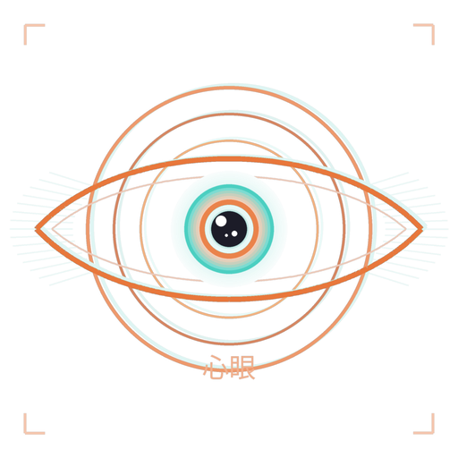

<p align="center">
  
</p>

<h1 align="center">shingan</h1>

<p align="center">
  <strong>Seeing through files to find the hidden doubles.</strong><br>
  <em>shingan (心眼) — the mind's eye that perceives what lies beneath the surface.</em>
</p>

<p align="center">
  <a href="#features">Features</a> &middot;
  <a href="#installation">Installation</a> &middot;
  <a href="#usage">Usage</a> &middot;
  <a href="#ml-categorization-pipeline">ML Pipeline</a> &middot;
  <a href="#architecture">Architecture</a> &middot;
  <a href="#license">License</a>
</p>

---

shingan is a high-performance file deduplication and organization toolkit written in Rust. It detects duplicate and near-duplicate files across images, videos, documents, code, and archives using perceptual hashing, text similarity, and content-aware analysis. A multi-tier ML categorization pipeline can further sub-classify images into 24 categories for automatic sorting. Everything runs offline and local-first — no cloud accounts required.

It ships as both a CLI tool and an Iced-based GUI application.

## Features

- **Perceptual duplicate detection** — finds near-duplicates, not just byte-identical copies
- **3-phase scanning** — file discovery, parallel signature analysis, union-find fuzzy grouping with strict membership validation
- **5 detection engines** — image, video, document, code, and archive, each with specialized algorithms
- **Multi-tier ML image categorization** — heuristics, structural analysis, local ONNX CLIP inference, and optional cloud vision APIs classify images into 24 sub-categories
- **Offline-first / local-first** — all core functionality works without network access; cloud APIs are opt-in behind feature flags
- **Pluggable architecture** — compile only the detectors and ML tiers you need via feature flags
- **Persistent signature cache** — computed signatures stored in SQLite keyed by file path, size, and modification time; rescanning unchanged files skips computation entirely
- **In-memory LRU caches** — per-detector signature and parse caches (`parking_lot::Mutex`) for fast within-scan comparisons
- **Auto-sorter** — rule-based file organization with optional ML-powered image sub-categorization
- **GUI with preview** — image thumbnails, syntax-highlighted code, PDF pages, video frames; paginated results (50 groups/page)
- **SQLite persistence** — WAL mode, indexed queries, batch inserts with transactions, full scan history
- **CSV export** — batch export results for external processing
- **Pause / resume / stop** — full scan lifecycle control
- **Progress tracking** — elapsed time, ETA, and percentage displayed in both CLI and GUI

## Detection Capabilities

| Category | Algorithm | Details |
|----------|-----------|---------|
| Image | Multi-hash perceptual (aHash + pHash + dHash) | 12x12 bit hashes via `img_hash`; all three must agree; 5000-entry signature cache + 10000-entry parse cache |
| Video | 3D DCT perceptual (`vid_dup_finder_lib` + FFmpeg) | Samples first 20s, skips 3s intro; 1000-entry signature cache + 2000-entry parse cache |
| Document | Text extraction + Sorensen-Dice coefficient | Supports PDF, DOCX, ODT, TXT, SRT, VTT, SUB, RTF |
| Code | Normalization + Sorensen-Dice coefficient | Strips comments and whitespace; syntax-aware comparison |
| Archive | SHA-256 exact match | Byte-for-byte content comparison |

## Supported Formats

| Type | Extensions |
|-----------|------------|
| Images | jpg, jpeg, png, gif, bmp, webp, tiff, svg |
| Documents | txt, doc, docx, odt, pdf, rtf, srt, vtt, sub |
| Videos | mp4, avi, mkv, mov, wmv, flv, webm, m4v |
| Archives | zip, tar, gz, bz2, xz, 7z, rar, zst |
| Code | py, js, ts, exs, html, css, jsx, tsx, vue, rs, go, cpp, c, h |

## ML Categorization Pipeline

When sorting images, shingan can sub-classify them into 24 categories using a multi-tier pipeline that escalates from cheap heuristics to heavier inference only when needed.

### Tiers

| Tier | Method | Cost | What it does |
|------|--------|------|--------------|
| **0** | Heuristics | ~0 ms | Resolution matching, EXIF presence, aspect ratio analysis. Catches screenshots, icons, and camera photos with high confidence. |
| **1** | Structure signals | ~5 ms | Pixel brightness, edge energy, perceptual hash stats. Identifies diagrams and scanned documents. |
| **2** | ONNX CLIP | ~50 ms | Runs a local CLIP ViT-B/32 image encoder and compares against precomputed text prototype vectors for all 24 categories via cosine similarity. |
| **3** | Cloud (optional) | ~500 ms | Sends the image to a vision-capable API (Ollama, OpenAI, or Gemini) for classification. Only fires when Tier 2 confidence is below threshold. |

Each tier has a configurable confidence threshold. If a tier's result exceeds its threshold, the pipeline stops and returns that result. Otherwise it escalates to the next tier.

### 24 Image Sub-Categories

Grouped by type:

| Group | Categories |
|-------|------------|
| **Screenshots** | `screenshot_desktop`, `screenshot_mobile`, `screen_recording_frame` |
| **Photos** | `photo_landscape`, `photo_portrait`, `photo_food`, `photo_animal`, `photo_architecture`, `photo_event`, `photo_product`, `photo_general` |
| **Art** | `artwork`, `anime_manga`, `pixel_art`, `comic`, `render_3d` |
| **Memes** | `meme` |
| **Info-dense** | `diagram`, `infographic_chart`, `scanned_document`, `handwritten` |
| **Design** | `ui_design`, `logo_icon` |
| **Fallback** | `other` |

### Model files

Tier 2 requires two files in `$XDG_DATA_HOME/shingan/models/` (typically `~/.local/share/shingan/models/`):

- `clip_image.onnx` — CLIP ViT-B/32 image encoder
- `clip_prototypes.bin` — precomputed L2-normalized text embeddings for each category's CLIP prompt (24 × embed_dim float32 values, little-endian)

If these files are absent, Tier 2 is silently skipped.

## Installation

### Prerequisites

- **Rust 1.80+**
- **FFmpeg / ffprobe** on `PATH` (required for video detection)
- **ONNX Runtime** libraries (auto-fetched by `ort` crate when building with the `onnx` feature)
- **Ollama** running locally (optional, for cloud-tier ML categorization)

### Build from source

```bash
git clone https://github.com/rc-basilisk/shingan.git
cd shingan
cargo build --release
```

The `shingan` binary will be at `target/release/shingan`.

### Feature flags

Detection engines (on `shingan-core`):

```bash
# All detectors (default)
cargo build --release

# Only image and document detection
cargo build --release --no-default-features --features image-detect,document-detect
```

Available: `image-detect`, `document-detect`, `code-detect`, `video-detect`.

ML pipeline (on `shingan-ml`):

| Flag | Effect |
|------|--------|
| `onnx` (default) | Local CLIP inference via ONNX Runtime |
| `cloud-ollama` | Ollama vision API categorizer |
| `cloud-openai` | OpenAI vision API categorizer (stub) |
| `cloud-gemini` | Google Gemini vision API categorizer (stub) |

## Usage

### CLI

```bash
# Scan directories for image and document duplicates with 95% similarity threshold
shingan scan ~/Photos ~/Documents -t image,document -T 0.95

# Sort files into category directories
shingan sort ~/Downloads --dest ~/Sorted

# Sort with ML-powered image sub-categorization
shingan sort ~/Downloads --dest ~/Sorted --classify

# List results from previous scans
shingan list
shingan list <SESSION_ID>

# Export a scan session to CSV
shingan export <SESSION_ID> -o results.csv
```

### GUI

```bash
# Launch the graphical interface
cargo run --release -p shingan-gui
```

The GUI provides tabbed access to the duplicate finder, auto-sorter, and settings. It supports dark and light themes, inline file preview, and batch deletion of duplicates.

<!-- TODO: add screenshot -->

## Architecture

shingan is organized as a Cargo workspace with six crates:

| Crate | Role |
|-------|------|
| `shingan-core` | Core detection engine with the pluggable `Detector` trait, LSH grouping, scan orchestration, file metadata enrichment |
| `shingan-ml` | Multi-tier image classification pipeline (heuristics, structure analysis, ONNX CLIP, cloud APIs) |
| `shingan-db` | SQLite persistence layer (WAL mode, bundled via `rusqlite`) |
| `shingan-utils` | File sorting utilities integrating `shingan-ml` for image sub-categorization |
| `shingan-cli` | CLI binary (`shingan`) exposing scan, list, export, and sort commands |
| `shingan-gui` | Iced-based GUI with duplicate finder, auto-sorter, and settings tabs |

### Key design decisions

- **Pluggable `Detector` trait** — each file category implements a common interface for signature computation and comparison, making it straightforward to add new detection strategies.
- **Two-tier LRU caching** — each detector maintains a bounded signature cache, and image/video detectors add a second parse cache to avoid re-deserializing signatures during pairwise comparisons. All caches use `parking_lot::Mutex` for non-poisoning, low-contention locking.
- **Union-find grouping** — duplicate candidates are clustered using LSH prefix bucketing, then merged via a union-find structure with path compression and union-by-rank. An incrementally maintained member map avoids O(n) scans per merge. Strict cross-validation before each merge ensures every file in a group is similar to every other file.
- **Escalating ML pipeline** — image classification starts with ~0 ms heuristics and only escalates to heavier ONNX inference or cloud APIs when confidence is insufficient, keeping average per-image cost low.
- **rayon** — signature computation is parallelized across available cores.
- **crossbeam-channel** — progress updates flow from worker threads to the UI without blocking.
- **Persistent signature cache** — a `signature_cache` table stores computed signatures keyed by `(file_path, file_size, modified_at, category)`. On rescan, unchanged files resolve from cache in microseconds instead of recomputing from disk.
- **Batch DB inserts** — duplicate groups are persisted in a single SQLite transaction, reducing lock contention and improving write throughput.
- **Indexed queries** — `file_path` and `created_at` columns are indexed for fast lookups and session listing.

## License

This project is released into the public domain under [CC0 1.0 Universal](LICENSE).

To the extent possible under law, the author has waived all copyright and related or neighboring rights to this work.
